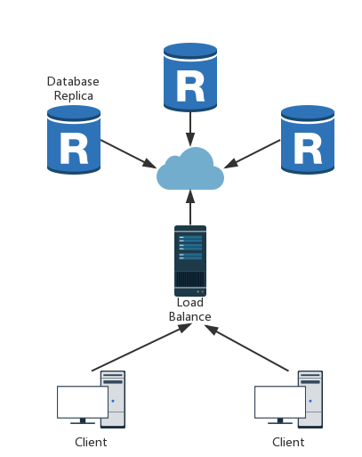

# A Simple Distributed Database Based on Gossip

> Ruiguang Li

A simple distributed database based on gossip protocol.

**Features**
- Gossip Protocol
- Multi-Client Support
- State Machine Replica
- Launch new replica at any time
- Crash Tolerant

## Table of Contents
- [1 Usage](#1-usage)
- [2 Details](#2-details)
    - [2.1 Architecture](#21-architecture)
    - [2.2 Client](#22-client)
        - [Command](#command)
    - [2.3 Load Balance Server](#23-load-balance-server)
        - [Details](#details)
    - [2.4 Database Replica Node](#24-database-replica-node)
        - [Gossip](#gossip)
        - [State](#state)
        - [Crash Tolerance](#crash-tolerance)

## 1 Usage
*Details of implementation will be discussed in next part.*

1. Launch Load Balance Server first:
```bash
$ python LoadBalanceServer.py
```

2. Then launch several Database Replica:
```bash
$ python DatabaseNode.py ip_address port
```

for example:
```bash
$ python DatabaseNode.py 127.0.0.1 10001
```
*Note that the Load Balance Server uses port 10000, so don't use it here.*

Database node replica can be launched at **any time** by running this file, and it can be terminated at **any time** by Ctrl+C to simulate replica crash.

The output includes:
- state: current state of this replica
- neighbors: neighbor replicas' information
- table: the table stored on this replica

*Note that the time interval of message transferring in gossip protocol is set to 1 second, so the output will be freshed per second. In addition, the Load Balance Server will choose two nodes to send the initial message in case of a crash one being chosen, so the nodes may finish to synchronize very fast when there are only several nodes running. By adding the number of running nodes it will be clear that the protocal works at a speed of 1 message/second.*

3. Launch the client:
```bash
$ python Client.py
```

Multi client is supported which means several clients can be launched at the same time and commands can be entered from different clients at the same time.

A simulated command interpretor is shown here, with mark '>' indicating each new line.
This simple interpretor supports two command: insert and delete
```sql
> insert name age
> delete name
```

The database contains a simple table with only two attribute: name and age. By using the insert and delete command, corresponding record will be inserted to or deleted from the table. Table on each Database Replica is shown by output of DatabaseNode.py.

## 2 Details
### 2.1 Architecture


This simple system consists of several clients, one load balance server and several database replica, which supports multi-client at the same time.

### 2.2 Client
Here I implement a simple client just as a simple example. The client provides simple REPL interface, which supports two basic command used in database: insert and delete.

A simple table is used here with two attributes: name and age.

| Name | age |
| - | -: |
| Tom | 18 |
| Jane | 20 |
| ... | ... |

#### Command
- *insert* should be followed by two arguments:
```sql
insert name age
```
for example
```sql
insert Tom 18
```
will insert the record <'Tom','18'> into the table.
Here name serves as the key value in that table. So when insert same name more than one time the table will keep the last one.

- *delete* should be followed by one arguments:
```sql
delete name
```
for example
```sql
delete Tom
```
will delete the record <'Tom','18'> from the table. As mentioned in *insert*, because the table will only keep the last one of the records with same name, there will not be duplicate name in the table.

The command received from the interpretor will be directly sent to the Load Balance Server. There would be no problem if multi-clients send commands at the same time or one client sends commands in a very fast speed, which will be discussed in the following parts.

### 2.3 Load Balance Server
Here I don't implement a real load balance algorithm for a simple demo. The program pick one replica randomly at a time.

#### Details
1. The server maintains a message queue, receiving all the commands sent by clients.
2. It owns a *SelfState* index indicating a separate state itself. Every time when it receives a command from client, a pair <*SelfState*,*Command*> will be pushed in the queue and then *SelfState* increases by one.
3. The state of replicas will be sent to the server periodically. It keeps listening for the states of all the database replicas, *ReplicaState*, and sends next command from the message queue to the picked replica to gossip **only when all the states of replicas reach a consensus and *SelfState* equals to *ReplicaState***, which is a **synchronous mechanism**.

Because gossip needs time to finish passing message to all replicas, this **mechanism** forces the replicas to gossip messages in order strictly. The *SelfState* and *ReplicaState* are separate variables and change separately. When they come to the same value, it means that the replicas have finished to gossip the last message exactly and ready for next one in message queue.

4. Besides commands from clients, the load balance server will also deal with messages from Database Replicas.
- Message asking for necessary information when a new replica is launched. Send back replica addresses as the neighbors of the new replica for gossip.
- Message of the state of replicas in a specific frequency. Update *ReplicaState*.

### 2.4 Database Replica Node
The database replicas synchronize the state and reach consensus by **gossip** protocol. For the convenience to observe message transferring, the frequency of gossip is set to 1 message/second, which means that while transferring messages using gossip, a node will pick a neighbor node and send message once a second.
A new replica can add to the system directly by running this file.

#### Gossip
The gossip protocol implemented here includes two behaviors:
- pull and push: It is used when a new replica is launched.
    1. Get neighbors from load balance server.
    2. Send pull request to a neighbor asking for current state and database.
    3. Receive current state and database.
    4. push new message.
- push: push new message to a neighbor.
    New message includes:
    1. Command sent from load balance server.
    2. New replica address when a new replica node is launched.

#### State
The replica node is implemented in a State Machine style. Every time a new message is received from other nodes, the state of this replica needs to update. The state is indicated by a variable separately in each replica node. When a replica needs to send a new message, it wraps the message as <*state+1, message*> to gossip.

There will be three possible cases of the **index** of message and the **state** of a replica:
1. index < state: It means that the replica receives an old message. Ignore it.
2. index = state: It means that the replica receives duplicate message. Ignore it.
3. index = state+1: It means that the replica receives a new message. Extract valid data from the message and gossip to next neighbor.
The mechanism mentioned in 2.3 guarantees that cases of index>state+1 will never happen, because load balance server will not send new message to replicas until they reach consensus, which means that there will not be more than one new message gossip between replicas.

#### Crash Tolerance
The replica node may be crashed at any time in the real world, therefore a simple crash tolerant method is implemented here. When a replica is crashed, which is simulated by terminating a DatabaseNode.py program, the crash event will also be treated as a state. While the state of a replica node is sent to the load balance server periodically, it serves as a heart-beat message to tell the server that the node is still alive. The server will record the time of last heart-beat for each node. When some nodes lose heart-beat for a while, it means a time out for the server and it will gossip message to other nodes, telling them to delete the crash nodes from their neighbor list. Because the crash is also treated as a state in replicas, it follows the **synchronous mechanism**.
